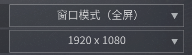
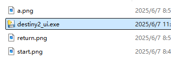

# Destiny2 自动化脚本 UI 工具

本工具基于 Python，提供一个图形界面，可自动识别 Destiny 2 窗口中的模板图片并自动点击/按键。支持自定义执行次数，并通过全局快捷键启动/停止。

## 功能特点

- **一键启动/停止**：  
  - 按 **F11** 或点击界面“开始”按钮启动  
  - 按 **End** 或点击界面“停止”按钮停止  
- **自定义执行次数**：在界面上输入最大执行轮次，0 或留空表示无限循环  
- **实时日志**：界面底部滚动日志区显示每一步状态  
- **全屏/无边框兼容**：~使用 Windows 原生 SendInput，支持全屏独占模式（我用的无边窗口化~只能用无边框全屏或者窗口化

## 快速开始
1. **游戏配置**  
   - 在 Destiny 2 游戏内依次选择 **熔炉竞技场 → 私人比赛**  
   - 模式选择：**碰撞**  
   - 地图选择：**无尽山谷**  
   - 设置目标得分：**5 分**，获胜后按 **Esc** 退出至出现“开始”图标的界面  

2. **下载并运行**  
   - 双击 `dist\destiny2_ui.exe`（已打包为单文件，可在任意 Windows 电脑上运行）  
   - **注意**：需以管理员身份运行，才能监听全局按键并模拟输入  

3. **配置模板图**  
   - 确保 `start.png`、`a.png`、`return.png` 与 exe 同目录，或在源码模式下与 `destiny2_ui.py` 同目录  
   
   - 确保该路径下没有中文，要不然会无法运行！
4. **使用面板**  
   1. 在“最大执行次数”框中输入数字（0=无限循环）  
   2. 点击“开始”或按 **F11** → 脚本开始自动化流程  
   3. 点击“停止”或按 **End** → 脚本立即停止 

## 源码运行（可选）

如果想在源码模式下运行，请确保安装以下依赖：

    pip install -r requirements.txt
然后执行：

    python destiny2_ui.py
